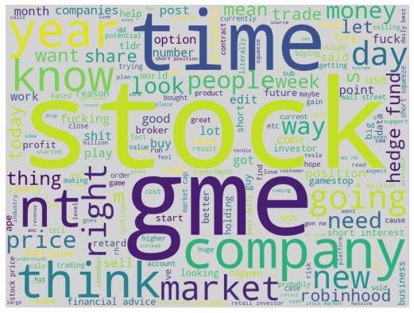

# WallstreetBets Topic modelling

From the mess that we've experienced in the financial markets in February 2020 due to the Redditers horde, I've got curious about the whys and hows this event happen. 

Being a Machine Learning practitioner I've decided to apply my NLP Knowledge, in the **topic modeling** domain, to the wsb dataset. A topic model is a type of statistical model for discovering the abstract "topics" that occur in a collection of documents. Topic modeling is a frequently used text-mining tool for discovery of hidden semantic structures in a text body. 

## Notebooks

- [WSB topic Modelling with SVD and LDA](wsb-topic-modelling.ipynb): this notebook is focused on topic modelling using the [SVD decompoistion](https://en.wikipedia.org/wiki/Singular_value_decomposition), a matrix factorization algorithms which is a generalization of the Eigenvalue decomposition, and the [LDA model](https://www.jmlr.org/papers/volume3/blei03a/blei03a.pdf), a generative probabilistic model for collections of discrete data such as text corpora.   
- [Topic Modelling with BERT](WSB_Topic_Modelling_with_BERT.ipynb): in this notebook the topic of the posts are directly clustered using [BERT](https://arxiv.org/pdf/1810.04805.pdf)

# Author 

Paolo D'Elia